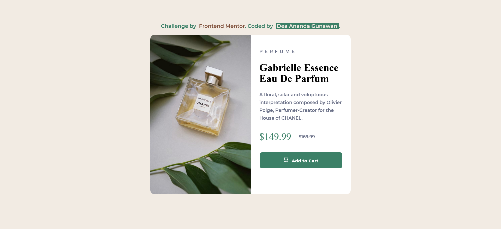

# Frontend Mentor - Product preview card component solution | Dea Ananda Gunawan

This is a solution to the [Product preview card component challenge on Frontend Mentor](https://www.frontendmentor.io/challenges/product-preview-card-component-GO7UmttRfa). Frontend Mentor challenges help you improve your coding skills by building realistic projects. 

## Table of contents

- [Overview](#overview)
  - [The challenge](#the-challenge)
  - [Screenshot](#screenshot)
  - [Links](#links)
- [My process](#my-process)
  - [Built with](#built-with)
  - [What I learned](#what-i-learned)
  - [Continued development](#continued-development)
- [Author](#author)
- [Feedback](#feedback-request)

## Overview

### The challenge

Users should be able to:

- See hover and focus states for interactive elements

### Screenshot




### Links

- Solution URL: [My Solution in Frontend Mentor]()
- Live Site URL: [Live site Preview Card](https://dea-preview-card.netlify.app)

## My process

### Built with

- Semantic HTML5 markup
- CSS custom properties
- CSS position
- Flexbox
- Mobile-first workflow

### What I learned

- How to use center a div with Flexbox
- How to implement ```display: inline-block```


### Continued development

I will later make the card responsive so it will also looks nice in mobile device's layout.

## Author

- Website - [Dea Ananda Gunawan](https://deaportfolio-recap.super.site)
- Frontend Mentor - [@peperoxyz](https://www.frontendmentor.io/profile/peperoxyz)
- Twitter - [@hellow_zz](https://www.twitter.com/hellow_zz)


## Feedback Request

I've tried my best to code it so it looks exactly the same as how it's designed. But I would be happy if you want to look at it and give me some feedbacks and advices for some things that could've done in a better way! (Please let me know! :D)
